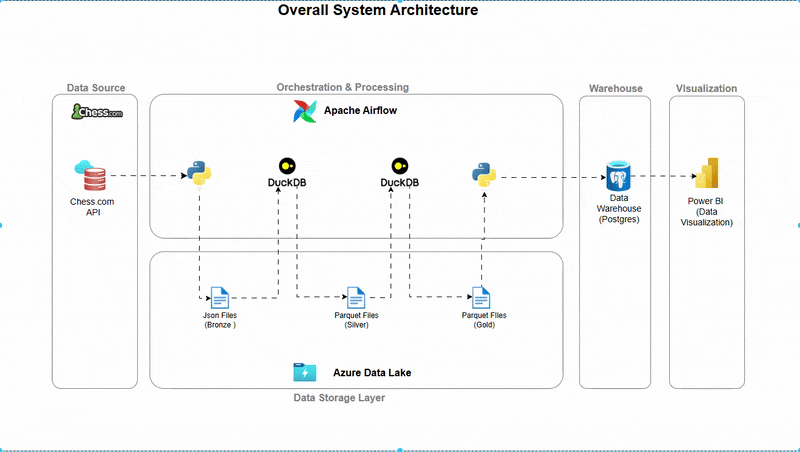
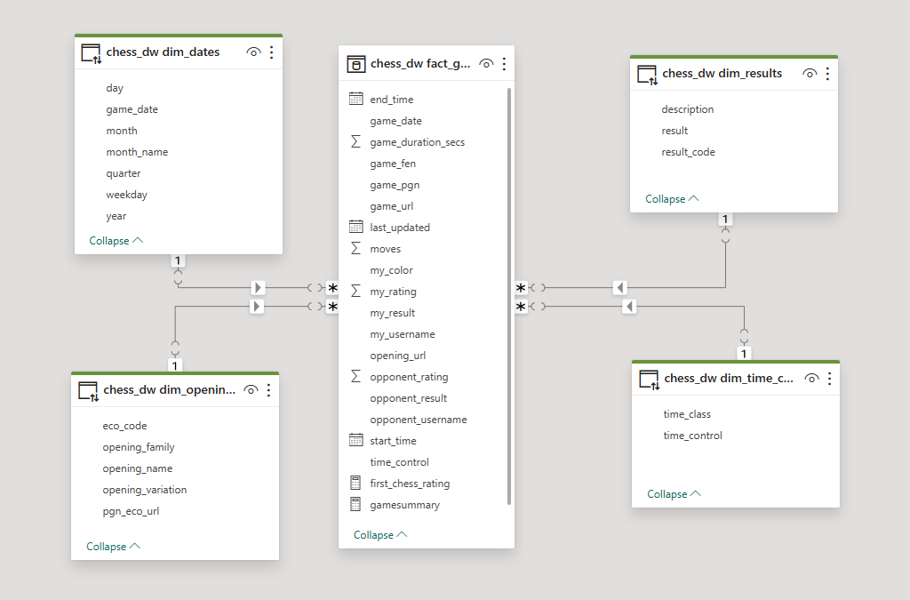
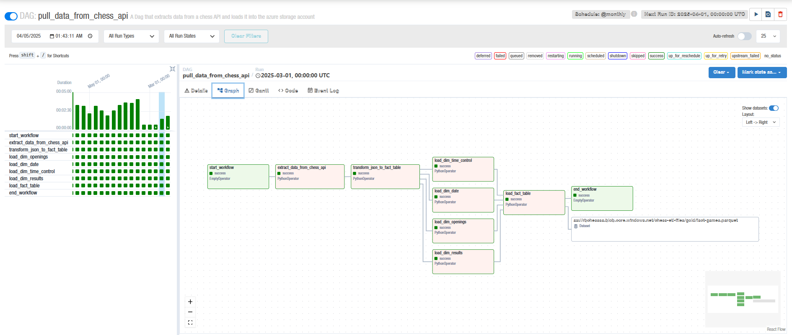

# End-to-End Chess.com ETL and Analytics Pipeline

## **Table of Contents**
1. [Project Overview](#10-project-overview)
   - [Goals and Objectives](#11-goals-and-objectives)
   - [How to Navigae Project Directory](#12-navigate-project-directory)
2. [Architecture & Workflow](#20-architecture--workflow)
   - [Data Flow](#data-flow)
   - [Tools & Technologies](#tools-&-technologies)
3. [Data Sources & Storage](#30-data-sources--storage)
   - [Data Sources](#data-sources)
   - [Storage Structure](#storage-structure)
4. [Dimensional Data Model](#40-dimensional-data-model)
5. [Approach & Pipeline Workflow (Airflow DAGs)](#50-approach--pipeline-workflow-airflow-dags)
   - [Workflow Steps](#workflow-steps)
   - [DAG 1](#dag-1)
   - [DAG 2](#dag-2)


## 1.0 Project Overview

This project aims to build an ETL pipeline to analyze my personal chess games and provide insights into the effectiveness of various chess openings. The data will be visualized on a live dashboard, enabling continuous tracking and analysis of performance over time.

<!-- ### 1.1 Video Introduction -->

### 1.1 Goals and Objectives

- Analyze chess games(battles) across different time periods to determine: 
    - Frequently Played Openings for White & Black across each game type(blitz, bullet, rapid) ✅
    - Which openings(strategies & variations) have yielded the highest win rates & loss rates in order to inform what variation i need to study to improve my top played openings✅
    - Openings & Variations that frequently lead to losses. ✅
    - Trends in performance over time based on opening. ✅
- Generate Videos(gifs) of Games using PGN file and automate upload to Social Media(Using NoCode)
- Utilize StockFish API to analyze Game PGN FIles and Generate puzzles for missed wins and Focrced Checkmates
- Provide insights through a live dashboard.

### 1.2 Navigate Project Directory
Root Folder 
```bash
.
├── README.md # Project Documentation File
├── airflow # Folder for Airflow Project Containing dags and airflow config files
├── dev_files # Folder used local development and testing functions
└── readme_images # images for the README file

```
---

Airflow Folder structure
```bash
├── Dockerfile # File used to create airflow docker container
├── config
├── dags
│   ├── collect_chess_data_dag.py # File containg DAG 1 definition
│   ├── load_data_warehouse_dag.py # File containing DAG 2 Definition
│   ├── sql # Contains SQL scripts used to query database
│   └── utils # Contains Python scripts, UDF's for Transformation stage of pipeline with duckdb
├── docker-compose.yaml # File used to deploy Airflow instance 
└── requirements.txt # python dependenciees

```

## 2.0 Architecture & Workflow


### Data Flow
- Airflow pulls data from Chess.com API and stages it in the bronze layer of the data lake
- Duckdb Transforms and cleans data in bronze layer and then stores it in Silver layer
- Finally Duckdb Performs final aggregations and stores data in the dimensinoal model format in the gold layer. 
- Airflow loads data from the Gold layer into Data Warehouse.
- PowerBI is used to build dashboards and reports   
### Tools & Technologies

| Category | Tools & Technologies Used |
| --- | --- |
| **Orchestration** | Apache Airflow |
| **Data Lake & Warehouse** | Azure Blob Storage, PostgreSQL |
| **Processing Engine** | DuckDB |
| **ETL Development** | Python, SQL |
| **Dashboarding** | Power BI |
| **Infrastructure** | Docker, Azure Services |


## 3.0 Data Sources & Storage

### **Data Sources:**

- **Chess API**: Fetches game records

### **Storage Structure:**

| Layer | Description |
| --- | --- |
| **Bronze** | Raw chess data (JSON) |
| **Silver** | Cleaned and transformed data (Parquet) |
| **Gold** | Data for fact and dimensional tables (PostgreSQL) |


## 4.0  Dimensional Data Model



## 5.0  **Approach & Pipeline Workflow (Airflow DAGS)**

### **Workflow Steps:**

1. **Extract**: Fetch chess game data from API and load unto Data Lake
2. **Transform**: Clean, structure, and 
3. **Load**: Store data into PostgreSQL.
4. **Visualization**: Power BI dashboard for insights

### DAG 1 

This First Dag 
- Pulls Data from the CHESS.com website 
- Loads the Data into the bronze layer in the data lake in it's raw Json Format
- Once the data arrives, The data is transformed and cleaned using DuckDB using SQL Queries alongside User Defined Functions in the dags/scripts/python_scripts.py folder and then the data is loaded back into the Silver Layer of the Datalake
- The data is then finally converted to suit the data warehouse schema using the Fact table and dimensional table displayed earlier and then loaded into the Gold Layer of the datalake.


### DAG 2

- This Final DAG is linked via the airflow dataset feature using the fact_table in the Gold layer. 
- Immediately the Fact table in the Gold layer is created, The DAG is created. 
- It First Created the Datawarehouse schema in the Postgres database if it does not already exists.
- Then it loads the data from the dim and fact tables in the gold layer into the postgres database.
